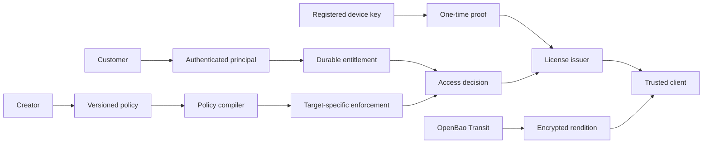

# Architecture and decision record

## Current bounded context

`packages/core` is a dependency-free domain/security library. Its calls are synchronous or narrowly asynchronous and make no database or network assumptions. It does not authenticate callers or store state. `packages/postgres` adds tenant-scoped transactions, atomic one-time device challenges, license issuance, and an asset publisher that commits catalog, policy, audit, and outbox rows together after encrypted object upload. `packages/openbao` supplies the active Transit signing and key-wrapping calls. `packages/aws-s3` uses the S3 protocol to store encrypted packages with checksums and conditional creation; the active target is SeaweedFS. `packages/api` verifies OIDC access tokens, maps verified subjects to active users, rate-limits requests in PostgreSQL, and exposes challenge, license, and optional creator publishing routes. The container entry point wires the API to PostgreSQL, OpenBao, and an explicit S3-compatible endpoint. The optional AWS KMS and Axinom adapters are inactive in this runtime.

## Architectural decisions

### ADR-001: One universal policy with fail-closed target compilation

**Context:** Assets need common business rights but different enforcement technologies. **Options:** separate rules for each media type, lowest-common-denominator rules, or a shared model with target compilation. **Decision:** shared ODRL-inspired policy, explicit compatibility matrix, and rejection of unsupported actions or constraints. **Security:** no silent weakening. **UX:** creators receive specific incompatibility explanations. **Operations:** provider adapters must add tested capabilities. **Consequence:** some otherwise valid business policies cannot publish on a target until an adapter exists.

### ADR-002: Short signed licenses separate from entitlements

**Context:** Purchases can be permanent while access tokens must expire and revoke. **Decision:** durable entitlement is distinct from short Ed25519-signed license. Signing uses an asynchronous interface and a pinned OpenBao Transit key version so signing key material stays outside the API process. The signer receives a domain-separated SHA-256 digest of canonical claims. **Security:** device proof and re-evaluation on renewal limit replay and stale authorization. **UX:** bounded offline leases can survive a brief service outage once a protected client exists. **Operations:** the license service and challenge store need high availability and atomic state. **Consequence:** revocation cannot invalidate a client already offline until its signed bound ends.

### ADR-003: AEAD chunks with external key wrapping

**Context:** Generic files have no common commercial DRM. **Decision:** AES-256-GCM per chunk with independent random 96-bit nonce and authenticated asset identity/index/length; signed manifest; 256-bit per-package content key passed through a `KeyWrapper`. Manifest signatures cover a domain-separated SHA-256 digest and use the asynchronous signer. **Security:** tampering fails authentication and the repository contains no production local root key. **UX:** chunks support partial retrieval. **Operations:** OpenBao rotation, backup, and audit procedures are still required. **Consequence:** a hostile client with a legitimate decryption key can still extract plaintext.

## Planned service boundaries

Keep identity, tenants, catalog, commerce, entitlements, and policy metadata in a modular application with PostgreSQL transaction boundaries. Extract license issuance and key operations into isolated services. Isolate ingestion/media processing, fingerprinting/watermarking, analytics, and remote execution by compute profile and security boundary. Use a durable outbox before adding a message bus; consumers must be idempotent. Redis/Valkey may cache short-lived state but never become the canonical entitlement store.

The service map covers identity/accounts/teams, creator and rights-holder management, catalog/assets/versions/renditions, ingestion and processing, rights and policies, entitlement/license/device/session, marketplace/commerce/billing/tax/royalties, library/search/recommendations, enterprise/lending, software and remote execution, provenance/fingerprinting/watermarking, fraud/audit/claims/moderation/support, analytics, developer APIs, and administration. These are planned boundaries, not implemented modules.

## Persistent data invariants for the next milestone

- Every tenant-sensitive row carries `tenant_id`; queries and database RLS must both enforce it.
- Published policy versions are immutable. Entitlements refer to the exact policy and asset version.
- Orders and royalties use append-only financial ledgers. Refunds are new reversing entries.
- Device challenges are random, expire quickly, and are consumed atomically.
- Issuance checks device limits and concurrent sessions inside a serialized transaction.
- Every security-sensitive mutation writes a non-secret audit event and transactional outbox record.

License issuance and device registration/revocation now write outbox rows in the same transaction as their state and audit changes. Claims use PostgreSQL `FOR UPDATE SKIP LOCKED` leases and tenant RLS. Downstream publication and consumer idempotency remain to be implemented.

## Enforcement boundary

The policy compiler currently produces a normalized, hashed plan and compatibility result. It does **not** generate full Widevine, FairPlay, PlayReady, Readium LCP, or remote-execution provider payloads. The Axinom adapter only builds a narrow online entitlement message from a verified license; it does not make those compiler targets compatible. A target adapter must be certified and contract-tested before a plan can be treated as enforcement for that target. Runtime packages are server-side primitives, not a consumer DRM client.

The PostgreSQL issuance path supports only `secureViewer` and rejects duties, territories, organization/role requirements, concurrent-session limits, metered use, export quotas, feature constraints, and credit limits because their authoritative systems are absent. It requires an injected key-reference verifier and signer; tests use test-only implementations. The API derives `authenticatedUserId` through its OIDC verifier and tenant-scoped active-user lookup. It never accepts this field from a request body. The identity provider must enforce the tenant claim before signing access tokens.
